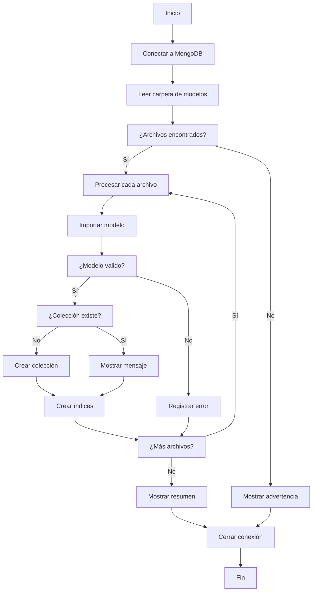

# Script de Migración - Documentación Técnica

## 📋 Descripción

El script `migrate.ts` es una herramienta automatizada que detecta y procesa todos los modelos de Mongoose en la carpeta `src/lib/models/`, creando las colecciones correspondientes en MongoDB y sincronizando sus índices.

## 🔧 Funcionamiento Interno

### 1. Conexión a la Base de Datos
```typescript
await connectDB();
```
- Utiliza la función `connectDB()` del archivo `src/lib/mongodb.ts`
- Maneja la conexión con cache para optimizar el rendimiento
- Verifica que la variable `MONGODB_URI` esté configurada

### 2. Detección de Modelos
```typescript
const modelsPath = join(process.cwd(), 'src', 'lib', 'models');
const modelFiles = readdirSync(modelsPath).filter(file => 
  file.endsWith('.ts') || file.endsWith('.js')
);
```
- Escanea la carpeta `src/lib/models/` automáticamente
- Filtra archivos `.ts` y `.js`
- Ignora otros tipos de archivos

### 3. Importación Dinámica
```typescript
const modelPath = join(modelsPath, file);
const modelModule = await import(modelPath);
const Model = modelModule.default;
```
- Importa cada modelo dinámicamente
- Espera que cada archivo exporte el modelo como `default`
- Valida que sea un modelo válido de Mongoose

### 4. Creación de Colecciones
```typescript
const collections = await mongoose.connection.db.listCollections().toArray();
const existingCollection = collections.find(col => col.name === collectionName);

if (!existingCollection) {
  await mongoose.connection.db.createCollection(collectionName);
}
```
- Verifica si la colección ya existe
- Crea la colección solo si no existe
- Utiliza el nombre de colección definido en el modelo

### 5. Sincronización de Índices
```typescript
await Model.createIndexes();
```
- Ejecuta `createIndexes()` en cada modelo
- Crea todos los índices definidos en el esquema
- Actualiza índices existentes si han cambiado

## 🎨 Características de la Salida

### Colores en Consola
```typescript
const colors = {
  reset: '\x1b[0m',
  bright: '\x1b[1m',
  green: '\x1b[32m',
  red: '\x1b[31m',
  yellow: '\x1b[33m',
  blue: '\x1b[34m',
  cyan: '\x1b[36m'
};
```

### Estados de Proceso
- 🚀 **Inicio**: Mensaje de bienvenida
- 📡 **Conexión**: Estado de conexión a MongoDB
- 📁 **Detección**: Lista de modelos encontrados
- 🔄 **Procesamiento**: Estado de cada modelo individual
- ✅ **Éxito**: Colecciones e índices creados
- ❌ **Error**: Problemas encontrados
- 📊 **Resumen**: Estadísticas finales

## 🛠️ Personalización

### Cambiar la Ruta de Modelos
```typescript
// Línea 28 en migrate.ts
const modelsPath = join(process.cwd(), 'src', 'lib', 'models');

// Cambiar a:
const modelsPath = join(process.cwd(), 'src', 'models');
```

### Agregar Validaciones Personalizadas
```typescript
// Después de la línea 60
if (!Model || !Model.collection) {
  // Agregar validaciones adicionales aquí
  if (!Model.schema) {
    console.log(`${colors.red}   ❌ Error: ${modelName} no tiene esquema válido${colors.reset}`);
    continue;
  }
}
```

### Modificar Opciones de Índices
```typescript
// Reemplazar línea 95
await Model.createIndexes();

// Con opciones personalizadas:
await Model.createIndexes({ background: true });
```

### Agregar Datos de Prueba
```typescript
// Después de crear la colección
if (!existingCollection) {
  await mongoose.connection.db.createCollection(collectionName);
  
  // Agregar datos de prueba
  if (modelName === 'User') {
    await Model.create({
      nombre: 'Usuario de Prueba',
      email: 'test@ejemplo.com',
      edad: 25
    });
  }
}
```

## 🚨 Manejo de Errores

### Tipos de Errores Manejados

1. **Error de Conexión**
   ```typescript
   catch (error) {
     console.error(`${colors.red}❌ Error durante la migración:${colors.reset}`, error);
     process.exit(1);
   }
   ```

2. **Modelo Inválido**
   ```typescript
   if (!Model || !Model.collection) {
     errors.push(`${modelName}: No es un modelo válido de Mongoose`);
     continue;
   }
   ```

3. **Error de Índices**
   ```typescript
   try {
     await Model.createIndexes();
   } catch (indexError) {
     console.log(`${colors.yellow}   ⚠️  Advertencia: Error creando índices`);
   }
   ```

### Códigos de Salida
- `0`: Éxito
- `1`: Error fatal

## 📝 Requisitos del Modelo

Para que un modelo sea procesado correctamente debe:

1. **Exportar como default**
   ```typescript
   export default mongoose.models.User || mongoose.model<IUser>('User', UserSchema);
   ```

2. **Ser un modelo válido de Mongoose**
   ```typescript
   const Model = mongoose.model('ModelName', schema);
   ```

3. **Tener un esquema definido**
   ```typescript
   const schema = new Schema({ ... });
   ```

## 🔄 Flujo de Ejecución



## 🧪 Testing

Para probar el script:

1. **Crear modelo de prueba**
   ```bash
   touch src/lib/models/Test.ts
   ```

2. **Ejecutar migración**
   ```bash
   npm run migrate
   ```

3. **Verificar en MongoDB**
   ```bash
   # Conectar a MongoDB y verificar colecciones
   db.runCommand("listCollections")
   ```

## 📚 Dependencias

- `mongoose`: ORM para MongoDB
- `fs`: Sistema de archivos (Node.js)
- `path`: Manipulación de rutas (Node.js)
- `tsx`: Ejecutor de TypeScript 